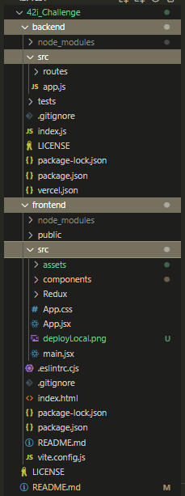
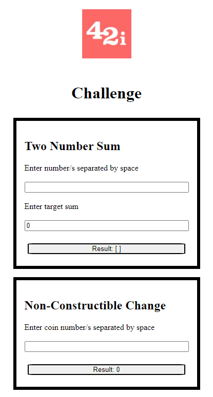
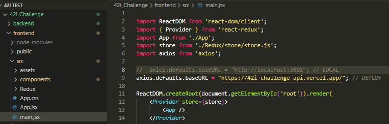

# 42i Challenge
This code is the solution for the 2 challenges:

- [Two Number Sum](https://42i.notion.site/Two-Number-Sum-83fced39cc3b4bb698c365fffa7b9444)

- [Non-Constructible Change](https://42i.notion.site/Non-Constructible-Change-e423c9af05c64621a40bf9dcefee3930)

It has been implemented in javascript with React library and Vite build tool, express and node js. Also, used React-Redux just for fun as it was not necesary for this particular task.   


## 📋Installation

⚠️NodeJS & NPM⚠️

-  **Node**: 18.16.0 o mayor
-  **NPM**: 9.5.1 o mayor

Check installed versions:

```bash
  node -v
  npm -v
```
There are 2 root folders. Open a terminal on each of them and install with npm:

- backend
```bash
  npm i
  npm start
```
- frontend
```bash
  npm i
  npm run dev
```
#### 📍 Root structure: 

There is a **src** folder on both sides, there you will find the components and most of the code.



## 📋API Reference

#### 📍 Get two Number Sum

```http
  POST /twoNumberSum
  // Using post to send req. parameters in the body
```

| Parameter  | Type     | Description                                    |
| :--------  | :------- | :--------------------------------------------- |
| `numbers`  | `array ` | **Required**. no repeated numbers              |
| `targetSum`| `number` | **Required**. sum of any pair from given array |

#### get_TwoNumSum({numbers, targetSum})

    Takes an array of numbers, a target sum number and returns an array of two numbers that 
    sums up the given target sum or an empty array if there is no match.

#### 📍 Get Non-Constructible Change

```http
  POST /nonConstChg
  // Using post to send req. parameters in the body
```

| Parameter  | Type     | Description                                    |
| :--------  | :------- | :--------------------------------------------- |
| `coins`    | `array ` | **Required**. positve integer numbers          |

#### get_NonConstChg(coins)

    Takes an array of positive integer numbers (accept repeated numbers) and returns the minimum 
    amount of change (the minimum sum of money) that cannot be created.
## 📋Demo

- [Click here to see the demo](https://42i-challenge-cli.vercel.app/)




## 📋Deployment

The project has been deployed on Vercel [https://vercel.com/]

Any change in the main branch (actually is the only one) will be directly aplied on deployed app.

⚠️To change to development⚠️



## 📋Running Tests

To run tests, run the following command on the backend terminal

```bash
  npm run test
```

You should see something like this:

```bash
Administrador@DESKTOP-T9H9DI6 MINGW64 ~/OneDrive/Documents/42i Test/42i_Challenge/backend (main)
$ npm run test

> backend@1.0.0 test
> jest --verbose --detectOpenHandles

 PASS  tests/nonConstChg.test.js
  ---------- `Non-Constructible Change` ----------
    Valid Cases:                                                                                                                                                                                                                           
      √ POST If coins are [1, 1, 2, 3, 5, 7, 22], should return 200, result 20 (179 ms)
      √ POST If coins are [1, 1, 2, 2, 3, 5, 7, 22], should return 200, result 44 (29 ms)
      √ POST If coins are [2, 2, 3, 5, 7, 22], should return 200, result 1 (45 ms)
      √ POST If coins are empty, should return 200, result 1 (45 ms)
    Invalid Cases:
      √ POST If coins is not an Array, should return 400 (34 ms)

 PASS  tests/twoNumberSum.test.js
  ---------- `Two Number Sum` ----------
    Valid Cases:
      √ POST If all values are correct and targetSum can be generated, should return 200 (61 ms)
      √ POST If all values are correct and targetSum can Not be generated, should return 200 and empty array (26 ms)
    Invalid Cases:
      √ POST If targetSum is 0, should return 400 (28 ms)
      √ POST If targetSum is not a Number, should return 400 (29 ms)
      √ POST If numbers is empty Array, should return 400 (40 ms)
      √ POST If numbers is not an Array, should return 400 (22 ms)
      √ POST If array contains repeated numbers, should return 400 (26 ms)

Test Suites: 2 passed, 2 total
Tests:       12 passed, 12 total
Snapshots:   0 total
Time:        3.247 s
Ran all test suites.
```
## Author
- [@diegozallocco](https://github.com/DiegoZallo/)

Contact: diegozallocco@hotmail.com